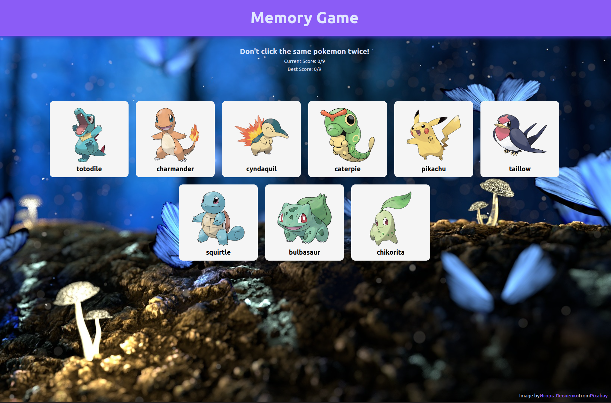

# Memory Game

### Memory Game for The Odin Project 🎮🎲🧠

Welcome to the React Memory Game, a delightful project developed using React for The Odin Project. This game is a classic memory matching game with a twist - every time a card is clicked, the entire board shuffles randomly. Leveraging the power of React and the useEffect hook, this project demonstrates the dynamic nature of user interfaces.

